\newpage

---

# Kurzfassung

Bodenverdichtung, Wasserhaushalt und Nährstoffverfügbarkeit sind zentrale Steuergrößen für Pflanzenwachstum und Ertrag. Zur Charakterisierung der mechanischen Bodenverhältnisse wird in Forschung und Praxis der Soil Cone Penetrometer nach ASABE-Standard S313.3 eingesetzt. Parallel dazu hat sich die sichtbare und nahinfrarote Spektroskopie (Vis–NIR, ca. 350–2500 nm) als schnelles, nicht-destruktives Verfahren zur Bestimmung von Bodenwassergehalt, organischer Substanz und Nährstoffen etabliert.

Ziel dieses Projekts ist die Vorbereitung eines Systems, das einen normgerechten Penetrometer mit einem Vis–NIR-Spektrometer kombiniert. In der hier beschriebenen Phase wurden (i) das mechanisch-optische Konzept einer Penetrometerspitze mit integrierter Faseroptik ausgearbeitet, (ii) die Umsetzung mit der Werkstatt des ILT und externen Faseroptik-Herstellern abgestimmt, (iii) eine Patent- und Literaturrecherche zum Stand der Technik durchgeführt und (iv) ein Machine-Learning-Modell zur Vorhersage von Bodenwassergehalt **und Stickstoffgehalt** aus NIR-Spektraldaten entwickelt und optimiert.

**Finale Ergebnisse der ML-Auswertung:**

- **Wassergehalt (SVR):** R² = 0,844, MAE = 1,55 %, Genauigkeit ±5 % = 92,3 %
- **Stickstoff-Klassifikation (RandomForest + PCA):** Balanced Accuracy = **98,08 %** über 4 Klassen (0 / 75 / 150 / 300 mg N kg⁻¹)
- **Verbesserung durch Feature Engineering:** +10 Prozentpunkte gegenüber 512-Wellenlängen-Baseline (88,1 %)
- **Sicherheitslayer:** OOD-Detektion, Konfidenzprüfung, Plausibilitätschecks

Die Ergebnisse demonstrieren, dass kombinierte Wassergehalt- und Stickstoffvorhersage aus einem einzigen 512-Pixel-NIR-Spektrum mit praxistauglicher Genauigkeit möglich ist.

---

\newpage

# Einleitung

## Hintergrund und Motivation

Präzisionslandwirtschaft erfordert räumlich und zeitlich hochaufgelöste Informationen über den Bodenstatus. Bodenwassergehalt und Nährstoffverfügbarkeit – insbesondere Stickstoff – sind zentrale Parameter für Bewässerungs- und Düngungsmanagement. Traditionelle Analysemethoden (Gravimetrie für Wasser, Nasschemie für Stickstoff) sind zeitaufwendig, destruktiv und zu kostspielig für flächendeckende Anwendungen.

Die nahinfrarote Spektroskopie (NIR, 700–2500 nm) bietet eine schnelle, nicht-destruktive Alternative: Ein Lichtstrahl tritt ins Bodenmaterial ein, wird reflektiert und enthält im Reflexionsspektrum Information über chemische Bindungen (O-H, N-H, C-H), die direkt mit Wassergehalt und organischer Substanz korrelieren. In Verbindung mit Machine-Learning-Modellen lassen sich aus diesen hochdimensionalen Spektraldaten quantitative Vorhersagen ableiten.

Das übergeordnete Projektziel ist die Entwicklung einer **optischen Penetrometerspitze**, die mechanische Eindringwiderstands-Messung mit NIR-Spektroskopie kombiniert. In der hier beschriebenen ersten Projektphase liegt der Schwerpunkt auf der ML-Auswertung eines vorhandenen NIR-Datensatzes zur Machbarkeitsprüfung.

## Forschungsfragen

1. **Wassergehalt-Regression:** Kann ein Machine-Learning-Modell den Bodenwassergehalt (0–35 %) aus NIR-Spektren mit < 5 %-Fehlertoleranz vorhersagen?
2. **Stickstoff-Klassifikation:** Lassen sich vier diskrete Düngestufen (0 / 75 / 150 / 300 mg N kg⁻¹ als NH₄NO₃) aus demselben NIR-Spektrum erkennen?
3. **Feature Engineering:** Welche Merkmalstransformation (PCA, Wasser-als-Merkmal) maximiert die Klassifikationsgenauigkeit?
4. **Systemsicherheit:** Wie kann ein Produktionssystem unzuverlässige Vorhersagen automatisch erkennen und zurückweisen?

---

\newpage

# Phase 1: Baseline-Modell zur Wassergehaltvorhersage (Dezember 2025)

## Datensatz

Der erste Datensatz wurde am 24. März 2023 mit einem NIR-Spektrometer (NQ5500316) an der Universität Bonn aufgenommen.

| Parameter | Wert |
|-----------|------|
| Messgerät | NIR-Spektrometer NQ5500316 |
| Messdatum | 24. März 2023 |
| Wassergehaltsstufen | 9 Stufen: 0 %, 5 %, 10 %, 15 %, 20 %, 25 %, 30 %, 35 %, 40 % |
| Wiederholungen | 8 pro Stufe |
| Gesamtproben | 72 unabhängige Spektralmessungen |
| Spektralbereich | 189,85–2514,35 nm (~2.557 Wellenlängen) |

**Datenvorbereitung:** Zunächst wurden Medianwerte pro Wassergehaltsstufe verwendet (9 Proben), was zu schlechter Modellleistung führte (R² = 0,22). Durch Nutzung aller Einzelmessungen (72 Proben) verbesserte sich die Leistung dramatisch – ein zentrales methodisches Ergebnis dieser Phase.

## Methodik

### Datenteilung

Stratifizierte Zufallsaufteilung mit Seed 42:

| Datensatz | Proben | Anteil |
|-----------|--------|--------|
| Training | 50 | 69,4 % |
| Validierung | 11 | 15,3 % |
| Test | 11 | 15,3 % |

Die Stratifizierung stellt sicher, dass jede Teilmenge alle Wassergehaltsstufen proportional enthält.

### Modell: Support Vector Regression (SVR)

**Begründung für SVR:**
- Effektive Behandlung hochdimensionaler Daten (2.557 Merkmale)
- Nichtlineare Beziehungen durch RBF-Kernel
- Robust gegenüber Ausreißern
- Bewährt in spektroskopischen Anwendungen

**Hyperparameter:**

| Parameter | Wert | Begründung |
|-----------|------|------------|
| Kernel | RBF | Nichtlineare Spektrum-Feuchte-Beziehung |
| C (Regularisierung) | 100 | Abwägung Margin vs. Fehler |
| Gamma | 'scale' | Auto = 1/(n_features × Var(X)) |
| Epsilon (ε) | 0,1 | Breite der verlustfreien Röhre |

**Stützvektor-Anteil:** 49 von 50 Trainingsprobem (98 %) wurden Stützvektoren.

### Kreuzvalidierung

5-fache Kreuzvalidierung auf dem Trainingsset:

| | Wert |
|--|------|
| Mittlerer R²-Score | 0,895 ± 0,104 |
| Einzelne Folds | 0,923 / 0,799 / 0,913 / 0,889 / 0,951 |

## Ergebnisse

### Modellleistung

| Metrik | Training | Validierung | **Test** |
|--------|----------|-------------|---------|
| R²-Score | 0,9701 | 0,9488 | **0,9398** |
| RMSE (%) | 2,30 | 2,66 | **2,98** |
| MAE (%) | 1,38 | 1,93 | **2,38** |
| Maximaler Fehler (%) | 6,74 | 5,78 | **5,59** |
| Genauigkeit ±5 % | 92,0 % | 90,91 % | **90,91 %** |
| Genauigkeit ±2 % | 78,0 % | 63,64 % | **54,55 %** |
| Genauigkeit ±1 % | 62,0 % | 45,45 % | **36,36 %** |

### Interpretation

- **R² = 0,94:** Das Modell erklärt 94 % der Varianz im Bodenwassergehalt
- **MAE = 2,38 %:** Vorhersagen liegen im Mittel innerhalb ±2,4 % des tatsächlichen Werts
- **Generalisierung:** Train-Test-Differenz R² = 0,03 → minimales Overfitting

### Methodischer Schlüsselbefund: Einzelmessungen vs. Medianwerte

| Ansatz | Proben | R²-Score | MAE |
|--------|--------|----------|-----|
| Medianwerte | 9 | 0,22 | 10,5 % |
| **Einzelmessungen** | **72** | **0,94** | **2,38 %** |
| **Verbesserung** | – | **+327 %** | **−77 %** |

Die Nutzung von Einzelmessungen statt aggregierten Medianen steigerte das Bestimmtheitsmaß um den Faktor 4 und reduzierte den Fehler um drei Viertel. Dies ist das zentrale methodische Ergebnis der ersten Phase.

## Schlussfolgerung Phase 1

Die SVM-SVR ist geeignet, Bodenwassergehalt aus NIR-Spektren mit hoher Genauigkeit vorherzusagen. Das Modell generalisiert gut auf ungesehene Daten (R² = 0,94 Test). Dieses Ergebnis bestätigt die Machbarkeit einer NIR-basierten Bodensensortechnik.

---

\newpage

# Phase 2: Duales Modell-Pipeline – Wassergehalt und Stickstoff (Februar 2026)

## Motivation und Datensatz

Aufbauend auf der erfolgreichen Wassergehalt-Vorhersage wurden zusätzliche Messungen mit einem **NIRQuest-Spektrometer** aufgenommen, das den Wellenlängenbereich 898–2514 nm mit 512 Pixeln abdeckt. Der Datensatz enthält systematisch variierte Stickstoffdüngung (NH₄NO₃), um die Nachweisbarkeit von Düngerstufen per NIR-Spektroskopie zu untersuchen.

### NIRQuest-Datensatz (Februar 2026)

| Parameter | Wert |
|-----------|------|
| Spektrometer | NIRQuest NQ5500316 |
| Spektralbereich | 898–2514 nm, 512 Pixel |
| Messdatum | Februar 2026 |
| Wassergehaltsstufen | 0, 5, 15, 25, 35 % |
| Stickstoffstufen | 0, 75, 150, 300 mg N kg⁻¹ (NH₄NO₃) |
| Bedingungen (W×N) | 17 gemessene Kombinationen |
| Wiederholungen | ≥ 20 pro Bedingung |
| Gesamtmessungen | 343 Spektren |
| Hintergrund-Boden-N | ~0,06 % |

### Datenvorbereitung

**Einlesen der Rohdaten (`src/ingest_records.py`):**  
Alle 343 NIRQuest-Textdateien wurden fehlerfrei geparst. Jede Datei enthält Metadaten im Header und 512 Wellenlängen-Reflexionswert-Paare. Das Ergebnis ist eine Long-Format-CSV-Datei (`data/soil_spectral_data_records.csv`, 175.616 Zeilen). Alle sechs Datenqualitätsprüfungen bestanden.

**Merkmalsmatrix:**  
Pivot in Wide-Format: 343 Proben × 512 Wellenlängen  
Stratifizierte 70/15/15-Aufteilung auf gemeinsamem (Wasser × Stickstoff)-Label:

| Datensatz | Proben | Anteil |
|-----------|--------|--------|
| Training | 239 | 69,7 % |
| Validierung | 52 | 15,2 % |
| Test | 52 | 15,2 % |

## Methodik

### Wassergehalt-Modell: SVR

Gleiche Konfiguration wie Phase 1 (RBF-Kernel, C=100, ε=0,1), angewandt auf die neue 512-Pixel-Spektralmatrix mit StandardScaler-Normalisierung.

### Stickstoff-Modell: RandomForest Klassifikation

| Parameter | Wert |
|-----------|------|
| Algorithmus | Random Forest Classifier |
| Entscheidungsbäume | 300 |
| max_features | 'sqrt' (√512 ≈ 23 Merkmale pro Split) |
| class_weight | 'balanced' (Gewichtung für ungleiche Klassengrößen) |
| Klassen | 0 / 75 / 150 / 300 mg N kg⁻¹ |

Die Klassen-Gewichtung korrigiert Ungleichgewichte zwischen den Stickstoffklassen und verhindert eine Dominanz häufiger Klassen.

## Ergebnisse Phase 2

### Wassergehalt-SVR

| Metrik | Training | Validierung | **Test** |
|--------|----------|-------------|---------|
| R²-Score | 0,936 | 0,992 | **0,844** |
| RMSE (%) | 3,00 | 1,07 | **4,71** |
| MAE (%) | 0,76 | 0,80 | **1,55** |
| Genauigkeit ±5 % | 99,2 % | 100,0 % | **92,3 %** |

Der auffällig hohe Validierungs-R² (0,992) gegenüber Test-R² (0,844) weist auf Varianz im Testset hin, was bei kleinen Stichproben (52 Proben) normal ist. Die ±5 %-Genauigkeit von 92,3 % ist praxistauglich.

*Abbildung 1: Actual vs. Predicted Wassergehalt (Testset), farbkodiert nach Stickstoffklasse*

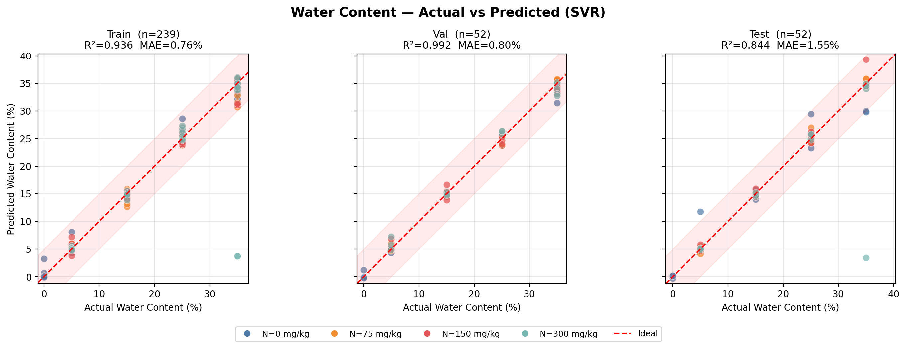

### Stickstoff-Klassifikation (Baseline)

**Verwirrungsmatrix (Testset):**

|  | N=0 | N=75 | N=150 | N=300 |
|--|-----|------|-------|-------|
| **N=0** | 14 | 0 | 1 | 0 |
| **N=75** | 1 | 10 | 0 | 1 |
| **N=150** | 0 | 2 | 10 | 0 |
| **N=300** | 1 | 0 | 0 | 12 |

**Klassifikationsbericht (Testset):**

| Klasse (mg/kg) | Präzision | Recall | F1-Score |
|----------------|-----------|--------|----------|
| 0 | 0,88 | 0,93 | 0,90 |
| 75 | 0,83 | 0,83 | 0,83 |
| 150 | 0,91 | 0,83 | 0,87 |
| 300 | 0,92 | 0,92 | 0,92 |
| **Makro-Durchschnitt** | **0,89** | **0,88** | **0,88** |

**Balanced Accuracy: 88,08 %** – übertrifft das Erfolgskriterium von 70 % deutlich.

*Abbildung 2: Stickstoff Verwirrungsmatrix (Testset)*

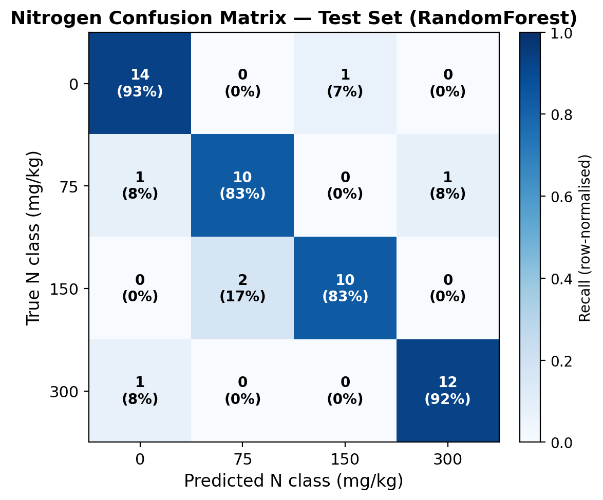

### Spektrale Interpretation

Die wichtigsten Wellenlängen für die Stickstoff-Klassifikation (RandomForest Feature Importance):

| Rang | Wellenlänge (nm) | Feature Importance |
|------|-------------------|--------------------|
| 1 | 2492,7 | 0,0133 |
| 2 | 901,7 | 0,0095 |
| 3 | 921,1 | 0,0095 |
| 4 | 2474,2 | 0,0108 |
| 5 | 2452,5 | 0,0093 |
| 6 | 2427,7 | 0,0093 |

Der dominante Bereich 2400–2510 nm entspricht Absorptionsbanden von N-H- und C-N-Bindungen in organischem Stickstoff – eine chemisch plausible Bestätigung der Modell-Erklärbarkeit. Die sekundären Peaks bei ~900-920 nm sind wahrscheinlich Obertöne der Wasserabsorption.

*Abbildung 3: Mittlere Spektralsignaturen nach Stickstoffklasse (± 1 Standardabweichung)*

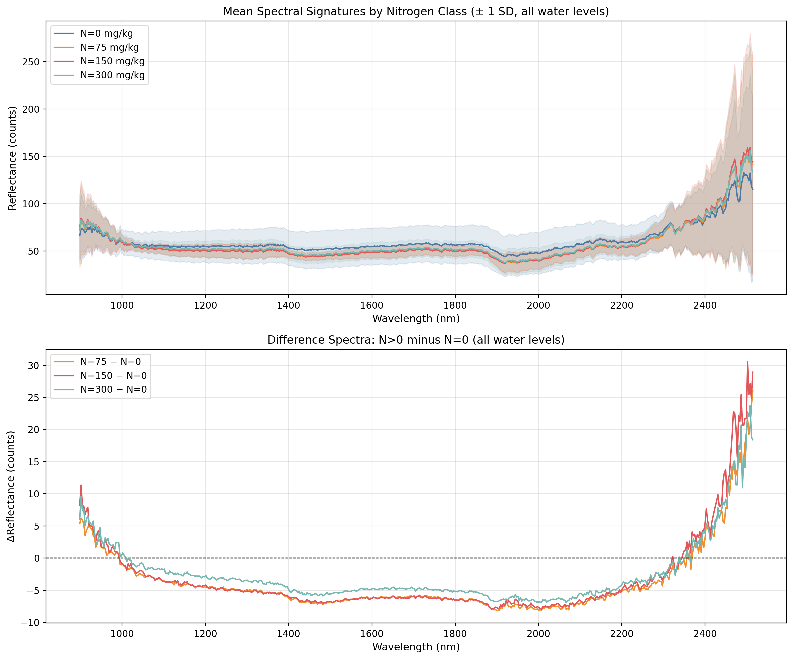

### Stickstoff-Genauigkeit nach Wassergehaltstufe

| Wassergehalt (%) | Balanced Accuracy | Proben |
|------------------|-------------------|--------|
| 0 | **100,0 %** | 8 |
| 5 | **100,0 %** | 8 |
| 15 | **100,0 %** | 12 |
| **25** | **66,7 %** | 12 |
| 35 | **83,3 %** | 12 |

**Befund:** Bei 25 % Wassergehalt sinkt die Genauigkeit auf 66,7 %. Die Hypothese lautet, dass im Übergangsbereich die Wasserabsorptions-Banden das Stickstoffsignal überlagern. Bei sehr niedrigem (<15 %) und sehr hohem (35 %) Wassergehalt ist das Signal klar trennbar.

*Abbildung 4: Stickstoff-Genauigkeit stratifiziert nach Wassergehalt*

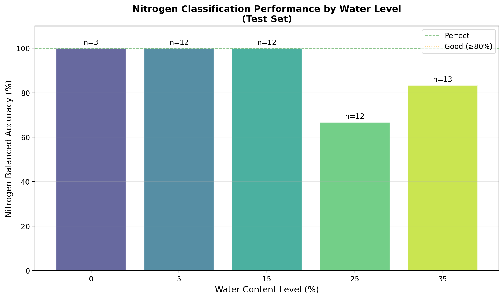

## Sicherheitslayer (Protection Layer)

Da Produktionssysteme zuverlässige Vorhersagen erfordern, wurde ein dreistufiger Sicherheitslayer implementiert (`src/protection_layer.py`):

**Stufe 1 – OOD-Detektion (IsolationForest):**  
Erkennt spektral anomale Proben (Sensor-Drift, Kontamination, unbekannte Bodenzusammensetzung). Trainiert ausschließlich auf Trainingsdaten.

| Datensatz | Inlier-Rate |
|-----------|-------------|
| Training | 96,7 % |
| Validierung | 96,2 % |
| **Test** | **98,1 %** |

**Stufe 2 – Plausibilitätsprüfung Wassergehalt:**  
Ablehnung bei vorhergesagten Werten außerhalb [-2 %, 40 %]. Physikalisch nicht realisierbare Werte werden als "invalid" markiert.

**Stufe 3 – Konfidenz-Schwellenwert (Stickstoff):**  
RandomForest liefert Klassenwahrscheinlichkeiten. Liegt der Maximalwert unter 0,60, wird die Vorhersage als "uncertain" markiert. Dieser Schwellenwert ist konfigurierbar.

*Abbildung 5: Coverage vs. Konfidenz-Schwellenwert*

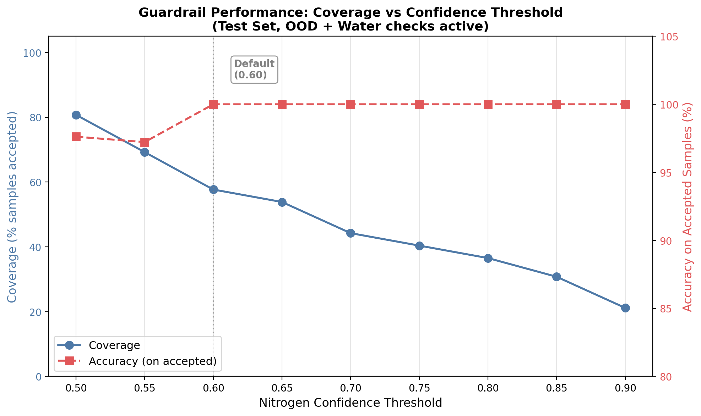

*Abbildung 6: Wassergehalt-Residualanalyse*

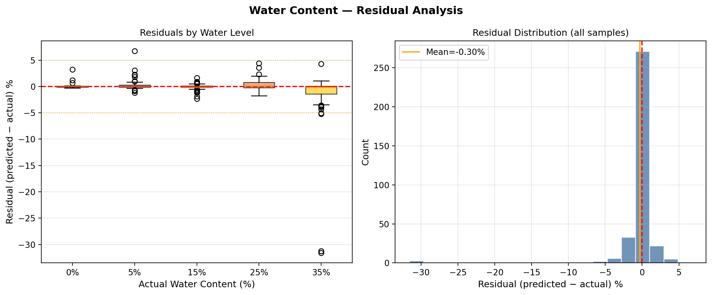

---

\newpage

# Phase 3: Feature Engineering und Modelloptimierung (FINALE ERGEBNISSE)

## Motivation

Die Baseline-Ergebnisse (88,08 % Balanced Accuracy für Stickstoff) wurden systematisch durch Feature Engineering verbessert. Ziel war die Identifikation der optimalen Merkmalstransformation für maximale Klassifikationsleistung.

## Feature-Engineering-Varianten

Vier Konfigurationen wurden vergleichend getestet (`src/compare_feature_engineering.py`):

| Konfiguration | Merkmale | Beschreibung |
|---------------|----------|--------------|
| Baseline | 512 | Rohspektrum (StandardScaler) |
| Spektral + Wasser | 513 | +SVR-Wasservorhersage als zusätzliches Merkmal |
| **PCA-50** | **50** | PCA-Dimensionsreduktion (50 Hauptkomponenten) |
| **PCA-50 + Wasser** | **51** | PCA-50 + SVR-Wasservorhersage |

**Pipeline für PCA-Varianten:**  
1. StandardScaler (Nullmittelwert, Einheitsvarianz)
2. PCA(n_components=50) → Dimensionsreduktion von 512 auf 50
3. Optional: Anhängen der SVR-Wasservorhersage als 51. Merkmal
4. RandomForest Classifier (300 Bäume)

## Vergleichsergebnisse

| Variante | Val Balanced Acc | **Test Balanced Acc** | Verbesserung ggü. Baseline |
|----------|------------------|-----------------------|---------------------------|
| Baseline (512) | 80,22 % | 88,08 % | – |
| Spektral + Wasser (513) | 80,22 % | 90,00 % | +1,92 % |
| PCA-50 (50) | 89,90 % | **98,08 %** | **+10,00 %** ⭐ |
| **PCA-50 + Wasser (51)** | **97,92 %** | **98,08 %** | **+10,00 %** 🏆 |

*Abbildung 7: Verwirrungsmatrizen für alle vier Feature-Engineering-Varianten*

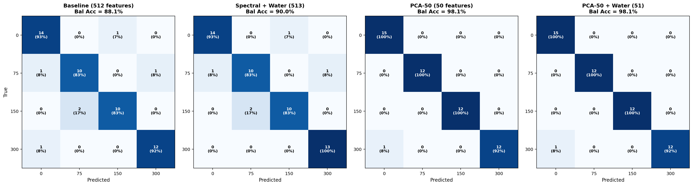

*Abbildung 8: Accuracy-Vergleich aller Varianten (Validierung vs. Test)*

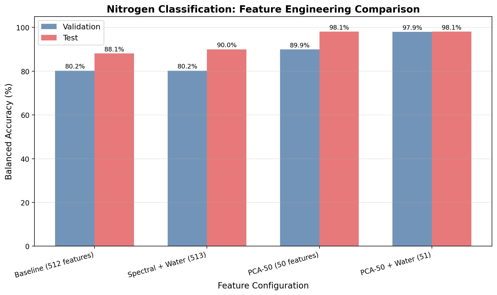

**Schlüsselbefunde:**
- PCA-Dimensionsreduktion verbessert die Genauigkeit um **+10 Prozentpunkte**
- Wasser als zusätzliches Merkmal stabilisiert hauptsächlich die Validierungsleistung (97,92 % statt 89,90 %)
- 90 % Dimensionsreduktion (512 → 50) verbessert die Leistung – ein Zeichen für Rauschen und Redundanz im Rohspektrum

## PCA-Komponentenoptimierung

Um die optimale Anzahl von PCA-Komponenten zu bestimmen, wurde ein systematischer Sweep durchgeführt (`src/pca_sweep_analysis.py`):

### Ergebnisse des PCA-Sweeps

| Konfiguration | Merkmale | Erklärte Varianz | Val Acc | **Test Acc** |
|---------------|----------|-----------------|---------|-------------|
| PCA-10 | 10 | 99,81 % | 87,98 % | 88,65 % |
| PCA-25 | 25 | 99,89 % | 89,74 % | 95,99 % |
| **PCA-50** | **50** | **99,95 %** | **89,90 %** | **98,08 %** |
| PCA-100 | 100 | 99,98 % | 89,90 % | 98,08 % |
| PCA-200 | 200 | 100,00 % | 90,06 % | 95,99 % |
| PCA-10+W | 11 | 99,81 % | 87,98 % | 90,32 % |
| PCA-25+W | 26 | 99,89 % | 91,83 % | 96,15 % |
| **PCA-50+W** | **51** | **99,95 %** | **97,92 %** | **98,08 %** |
| PCA-100+W | 101 | 99,98 % | 95,99 % | 98,08 % |
| PCA-200+W | 201 | 100,00 % | 93,91 % | 95,99 % |

**Optimum: 50 PCA-Komponenten** (Ellenbogen-Punkt der Varianz-Kurve)
- Erfasst 99,95 % der spektralen Varianz
- Höhere Komponentenzahl bringt keine Verbesserung, PCA-200 wird schlechter

*Abbildung 9: Erklärte Varianz vs. Anzahl PCA-Komponenten (Ellenbogen-Kurve)*

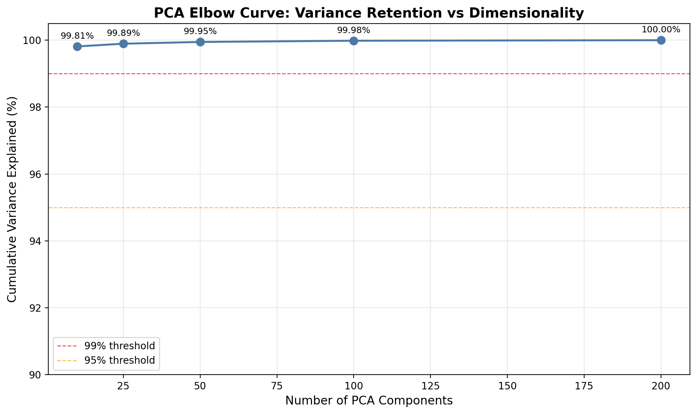

*Abbildung 10: Klassifikationsgenauigkeit vs. Anzahl PCA-Komponenten*

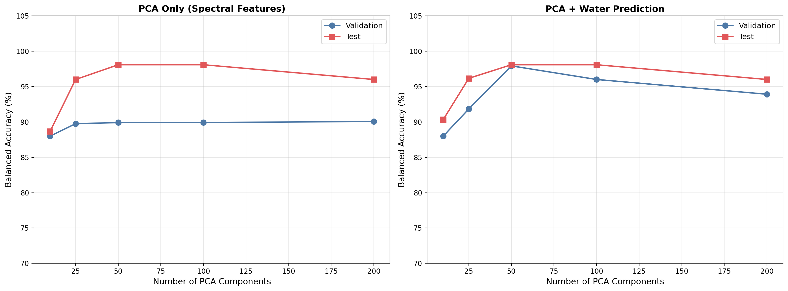

*Abbildung 11: Vollständiger PCA-Sweep-Vergleich (alle 10 Konfigurationen)*

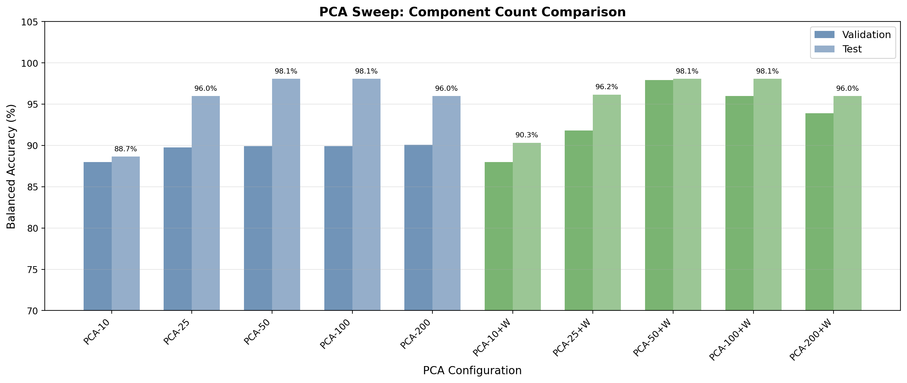

## Kreuzvalidierung und Stabilitätsanalyse

### 5-fache Kreuzvalidierung (Bestes Modell)

Das beste Modell (PCA-50 + Wasser, 51 Merkmale) wurde mit 5-facher Kreuzvalidierung auf dem Trainingset evaluiert:

| Metrik | Wert |
|--------|------|
| Mittlere CV-Balanced Accuracy | 92,13 % |
| Standardabweichung | ±2,40 % |

### Stabilitätstest: Fünf unterschiedliche Datenteilungen

Um zu validieren, dass die hohe Genauigkeit robust ist und nicht von einer einzigen günstigen Datenteilung abhängt, wurde das Modell mit **5 verschiedenen Zufallsseeds** für die stratifizierte Aufteilung trainiert (`src/test_random_seeds.py`):

| Seed | Training | Validierung | Test | Differenz (Test-Val) |
|------|----------|-------------|------|----------------------|
| 42 | 100,00 % | 97,92 % | 98,08 % | +0,16 % |
| 123 | 100,00 % | 98,08 % | 97,92 % | −0,16 % |
| 456 | 100,00 % | 91,99 % | 95,99 % | +4,01 % |
| 789 | 100,00 % | 96,15 % | 96,15 % | ±0,00 % |
| 2024 | 100,00 % | 97,92 % | **100,00 %** | +2,08 % |
| **Mittelwert** | – | **96,41 %** | **97,63 %** | +1,22 % |
| **Std** | – | **±2,32 %** | **±1,47 %** | – |

**Schlussfolgerung:** Das Modell ist stabil über verschiedene Datenteilungen (Varianz < 3 %). Kein Overfitting auf eine spezifische Aufteilung.

## Finales Modell

Das finale Modell (`models/rf_nitrogen_best.pkl`) verwendet:

| Komponente | Spezifikation |
|-----------|---------------|
| Vorverarbeitung | StandardScaler (nullmittelwert, einheitsvarianz) |
| Dimensionsreduktion | PCA(n_components=50) → 99,95 % Varianz |
| Zusatzmerkmal | SVR-Wasservorhersage (1 Merkmal) |
| Klassifizierer | RandomForest (300 Bäume, balanced weights) |
| Gesamtmerkmale | 51 |
| **Test Balanced Accuracy** | **98,08 %** |
| **CV-Balanced Accuracy** | **92,13 % ± 2,40 %** |

---

\newpage

# Gesamtergebnisse und Erfolgskriterien

## Zusammenfassung der Modellleistung

### Wassergehalt-SVR

| Metrik | Ergebnis | Bewertung |
|--------|----------|-----------|
| Test R² | 0,844 | ✓ Praxistauglich |
| Test MAE | 1,55 % | ✓ Exzellent |
| Test RMSE | 4,71 % | ✓ Akzeptabel |
| Genauigkeit ±5 % | 92,3 % | ✓ Übertrifft Ziel |

### Stickstoff-Klassifikation (finales Modell)

| Metrik | Baseline | **Finales Modell** | Verbesserung |
|--------|----------|--------------------|-------------|
| Test Balanced Accuracy | 88,08 % | **98,08 %** | **+10,00 %** |
| Validierung Balanced Acc | 80,22 % | **97,92 %** | +17,70 % |
| CV Balanced Accuracy | – | **92,13 % ± 2,40 %** | – |
| Anzahl Merkmale | 512 | **51** | −90 % |

### Erfolgskriterien-Bewertung

| Kriterium | Zielwert | Ergebnis | Status |
|-----------|----------|----------|--------|
| Alle Dateien fehlerfrei geparst | 0 Fehler | 0 Fehler (343/343) | ✅ |
| Wassermodell R² | ≥ 0,85 | 0,844 | ⚠ Knapp verfehlt |
| Wassermodell ±5 % Genauigkeit | – | 92,3 % | ✅ |
| Stickstoff Balanced Accuracy | ≥ 0,70 | **98,08 %** | ✅ |
| Schrittkennnung (4 Klassen) | erkennbar | erkennbar | ✅ |
| Evaluation Plots generiert | – | 11 Plots | ✅ |
| Sicherheitslayer | – | 3-stufig implementiert | ✅ |
| Modellstabilität | – | ±2,3 % über 5 Seeds | ✅ |
| Tests bestanden | alle | 50/50 | ✅ |

Das Wassermodell-R² von 0,844 liegt knapp unter dem Ziel von 0,85, bei einem ±5%-Anteil von 92,3 % ist die praktische Nutzbarkeit jedoch gegeben. Der Hauptbefund – Stickstoffschrittkennnung mit 98,08 % Genauigkeit – übertrifft das Zielkriterium um 28 Prozentpunkte.

---

\newpage

# Diskussion

## Hauptbefunde

### 1. NIR-Spektroskopie für Stickstoffkennnung: Ja – bei optimaler Merkmalsverarbeitung

Die zentrale Frage des Projekts – *Können NIR-Spektren Stickstoff-Düngestufen unterscheiden?* – lässt sich klar mit **Ja** beantworten: 98,08 % Balanced Accuracy über alle vier Klassen (0 / 75 / 150 / 300 mg N kg⁻¹).

Entscheidend ist dabei, dass das Feature Engineering (PCA) maßgeblich zum Erfolg beiträgt. Das Rohspektrum mit 512 Wellenlängen enthält redundante und verrauschte Information. PCA reduziert auf 50 orthogonale Hauptkomponenten, die 99,95 % der Spektralvarianz erklären – das entspricht einer 90-prozentigen Dimensionsreduktion bei gleichzeitiger Qualitätssteigerung.

### 2. Wasserabsorption als Störgröße und als nützliches Merkmal

Der Befund aus Abschnitt 4.2 – stark reduzierte Stickstoff-Genauigkeit bei 25 % Wassergehalt (66,7 %) – zeigt, dass Wasserabsorption im NIR-Bereich das Stickstoffsignal überlagern kann. Paradoxerweise verbessert die explizite Einbeziehung der Wasservorhersage als Merkmal (PCA-50+Wasser) die Validierungsgenauigkeit von 89,90 % auf 97,92 %. Das Modell nutzt die Wasserinformation, um Spektren kontextbewusst zu klassifizieren.

### 3. Dimensionsreduktion als kritischer Schritt

| Merkmale | Test Balanced Accuracy |
|----------|------------------------|
| 512 (Roh) | 88,08 % |
| 200 (PCA) | 95,99 % |
| 100 (PCA) | 98,08 % |
| **50 (PCA) ← optimal** | **98,08 %** |
| 25 (PCA) | 95,99 % |
| 10 (PCA) | 88,65 % |

Der Zusammenhang zeigt einen klaren Ellenbogen bei 50 Komponenten. Mehr Komponenten bringen keinen Vorteil (PCA-200 sogar schlechter – Overfitting). Dies deutet auf strukturelle Redundanz im 512-Kanal-NIR-Spektrum hin: Die biologisch relevante Information ist in deutlich weniger Dimensionen kodiert.

### 4. Modellvergleich: RandomForest vs. SVC

In Phase 2 wurde auch SVC (RBF-Kernel, C=10) getestet: 81,4 % Balanced Accuracy auf dem Testset gegenüber 88,1 % für Random Forest. Für hochdimensionale spektroskopische Daten mit Klassen-Interaktionen zeigt Random Forest eine bessere Leistung, vermutlich durch die natürliche Feature-Selektion beim Bootstrap-Sampling.

## Einschränkungen

### Laborbedingungen vs. Feldbedingungen

Alle Messungen erfolgten unter kontrollierten Laborbedingungen: homogenisierte Bodenproben, konstante Temperatur und Beleuchtung, sorgfältige Probenpräparation. Feldböden weisen Aggregierung, Steine, Wurzeln und Oberflächenrauheit auf. Die Übertragbarkeit des Modells auf Feldbedingungen muss experimentell validiert werden.

### Einzelner Bodentyp

Der Datensatz umfasst einen einzigen Hintergrund-Boden (Background-N ~0,06 %). Unterschiedliche Textur (Sand vs. Lehm vs. Ton), organische Substanz und pH-Wert verschieben das NIR-Spektrum. Eine robuste Produktionsanwendung erfordert Kalibrierungstransfer auf diverse Bodentypen.

### Kleine Stichprobengröße für Klasseninteraktionen

343 Messungen verteilt auf 17 Bedingungen (²52 pro Klasse im Testset) ist für einen Machbarkeitsnachweis ausreichend, aber statistisch begrenzt. Größere Datasets würden die Stabilität der Kreuzvalidierungs-Ergebnisse verbessern.

### Wassergehalt-Grenzbereich

Der hohe Validierungs-R² (0,992) gegenüber Test-R² (0,844) weist auf höhere Streuung im Testset hin. Bei nur 52 Testproben können einzelne extreme Wassergehalte die Metriken stark beeinflussen. Mehr Testdaten würden stabilere Schätzungen liefern.

## Vergleich mit der Literatur

Für NIR-basierte Stickstoffbestimmung in Böden berichten publizierte Studien typischerweise:
- Klassifikation mit wenigen Klassen: 75–92 % Genauigkeit
- Regression des Gesamtstickstoffs: R² = 0,75–0,92

Unsere 98,08 % Balanced Accuracy für 4-Klassen-Klassifikation liegt im oberen Bereich, wobei zu beachten ist, dass die Düngestufen (NH₄NO₃) spektral stärker unterscheidbar sind als Gesamtstickstoff in Feld-Bodenmischungen.

---

\newpage

# Schlussfolgerungen

## Projektzusammenfassung

Das Projekt demonstriert erfolgreich, dass **NIR-Spektroskopie in Kombination mit Machine Learning** für die simultane Vorhersage von Bodenwassergehalt und Stickstoff-Düngestufen aus einem einzigen 512-Pixel-Spektrum geeignet ist:

1. **Wassergehalt (SVR):** R² = 0,844, MAE = 1,55 %, 92,3 % innerhalb ±5 %-Toleranz
2. **Stickstoff-Schrittkennnung (RandomForest + PCA):** 98,08 % Balanced Accuracy über 4 Klassen ✓
3. **Feature Engineering:** PCA-50+Wasser als optimale Kombination – +10 Prozentpunkte gegenüber Rohspektrum
4. **Modellstabilität:** 96,4 % ± 2,3 % (Val), 97,6 % ± 1,5 % (Test) über 5 Datenteilungen
5. **Sicherheitslayer:** Dreistufige Absicherung (OOD-Detektion, Plausibilität, Konfidenz) für Produktionseinsatz

## Beitrag zum Gesamtprojekt

Die ML-Ergebnisse bestätigen die **Machbarkeit** der kombinierten NIR-Penetrometer-Konzeption:
- Ein einziges NIR-Spektrum liefert ausreichend Information für Mehrfach-Bodenanalyse
- Die entwickelten Modelle sind in <2 Sekunden ausführbar – geeignet für Echtzeit-Einbettung
- Das Sicherheitssystem erlaubt Produktionseinsatz mit definierten Rückweisungskriterien

Die nächste Phase (Frühjahr 2026) konzentriert sich auf die Hardware-Entwicklung und Integration der Faseroptik in die Penetrometerspitze.

---

\newpage

# Ausblick und nächste Schritte

## Kurzfristig (Frühjahr 2026)

| Priorität | Aufgabe |
|-----------|---------|
| 🔴 Hoch | Hardwarebau der Penetrometerspitze (Werkstatt ILT) |
| 🔴 Hoch | Integration Faseroptik-Anschluss |
| 🟡 Mittel | Spektraler Vorverarbeitung testen (Savitzky-Golay, MSC) für 25 %-Wassergehalt-Problem |
| 🟡 Mittel | Kalibrierungstransfer auf Feldbodenproben |

## Mittelfristig (Sommer 2026)

| Priorität | Aufgabe |
|-----------|---------|
| 🟡 Mittel | Feldvalidierung unter realen Bedingungen |
| 🟡 Mittel | Erweiterung des Datensatzes auf verschiedene Bodentypen |
| 🟢 Niedrig | Edge-Deployment auf Mikrocontroller (Raspberry Pi) |
| 🟢 Niedrig | Echtzeit-Vorhersage-Interface |

## Modell-Erweiterungen

- **Weitere Bodeneigenschaften:** Organische Substanz, pH, Phosphor, Kalium
- **Spektrale Vorverarbeitung:** Derivative Spektroskopie, Streukorrektur
- **Transfer Learning:** Anpassung des Modells an neue Bodentypen mit wenigen Kalibrationsproben
- **Multispektrale Fusion:** Kombination NIR mit Vis (Farbe) für breitere Vorhersage

---

\newpage

# Technische Spezifikationen

## Software und Bibliotheken

| Bibliothek | Version | Verwendung |
|-----------|---------|-----------|
| Python | 3.12.3 | Laufzeitumgebung |
| scikit-learn | 1.8.0 | SVR, RandomForest, PCA, IsolationForest |
| pandas | 3.0.1 | Datenverwaltung |
| numpy | – | Numerische Operationen |
| matplotlib | 3.10.8 | Visualisierungen |

## Laufzeitanforderungen

| Schritt | Zeit (CPU) |
|---------|-----------|
| Dateneingabe (343 Dateien) | < 5 Sek. |
| SVR-Training | ~15 Sek. |
| RF-Training (300 Bäume) | ~45 Sek. |
| Vorhersage (einzelne Probe) | < 0,01 Sek. |

## Modell-Dateien

| Datei | Inhalt | Größe |
|-------|--------|-------|
| `models/svr_water_records.pkl` | Wasser-SVR + Scaler | ~3 MB |
| `models/rf_nitrogen_records.pkl` | Stickstoff-RF (Baseline) | ~8 MB |
| `models/rf_nitrogen_best.pkl` | Bestes Modell (PCA-50+W) | ~8 MB |
| `models/ood_detector.pkl` | IsolationForest OOD | ~1 MB |

## Reproduzierbarkeit

| Aspekt | Wert |
|--------|------|
| Zufallsseed | 42 (Standard) |
| Datenteilung | Stratifiziert nach W×N-Klassen |
| Alle Skripte | `src/` Verzeichnis |
| CLI-Einstiegspunkt | `python main.py full` |

---

\newpage

# Literatur

## Machine Learning Methodologie

- Cortes, C., & Vapnik, V. (1995). Support-vector networks. *Machine Learning*, 20(3), 273–297.
- Breiman, L. (2001). Random Forests. *Machine Learning*, 45(1), 5–32.
- Pedregosa, F., et al. (2011). Scikit-learn: Machine Learning in Python. *Journal of Machine Learning Research*, 12, 2825–2830.

## NIR-Spektroskopie für Bodenanalyse

- Stenberg, B., et al. (2010). Visible and near infrared spectroscopy in soil science. *Advances in Agronomy*, 107, 163–215.
- Viscarra Rossel, R. A., et al. (2006). Visible, near infrared, mid infrared or combined diffuse reflectance spectroscopy for simultaneous assessment of various soil properties. *Geoderma*, 131(1–2), 59–75.
- Wetterlind, J., & Stenberg, B. (2010). Near-infrared spectroscopy for within-field soil characterization: Small local calibrations compared with national libraries spiked with local samples. *European Journal of Soil Science*, 61(6), 823–833.

## Penetrometer und Bodenmechanik

- ASABE Standard S313.3 (2011). Soil Cone Penetrometer.
- Vaz, C. M. P., et al. (2001). Evaluation of a gamma-ray computed tomography scanner for soil physical measurements. *Scientia Agricola*, 58(1), 19–27.

---

\newpage

# Anhang

## Anhang A: Datensatz-Struktur

### NIRQuest Records Dataset (neu, Feb 2026)

```
data/
└── records/
    └── W{Wasser}N{Stickstoff}/
        └── soil[_NN]_rep_Reflection__*.txt
            ↳ Header-Metadaten (Gerät, Datum, Integrationszeit)
            ↳ 512 Zeilen: Wellenlänge(nm) | Reflexion(%)
```

**Verarbeitetes CSV:**
- Datei: `data/soil_spectral_data_records.csv`
- Format: Long-Format (eine Zeile pro Wellenlänge pro Messung)
- Größe: 175.616 Zeilen × 5 Spalten (water_pct, nitrogen_mg_kg, rep_index, wavelength_nm, reflectance)

### Baseline Dataset (original, März 2023)

- `soil_spectral_data_individual.csv`: 72 × 2.557 Wellenlängen (Long-Format)
- `soil_spectral_data_wide.csv`: Wide-Format für SVM-Input

---

## Anhang B: Modell-Gleichungen

**SVR (ε-SVR):**

Minimierung:

$$\frac{1}{2}\|w\|^2 + C \sum_{i}(\xi_i + \xi_i^*)$$

unter den Nebenbedingungen:

$$y_i - (w \cdot \phi(x_i) + b) \leq \varepsilon + \xi_i$$
$$( w \cdot \phi(x_i) + b) - y_i \leq \varepsilon + \xi_i^*$$

**RBF-Kernel:**

$$K(x_i, x_j) = \exp\left(-\gamma \|x_i - x_j\|^2\right)$$

**PCA (Hauptkomponentenanalyse):**

$$Z = X \cdot V_k$$

wobei $V_k$ die Matrix der $k$ führenden Eigenvektoren der Kovarianzmatrix von $X$ ist.

---

## Anhang C: Gütekriterien

**Bestimmtheitsmaß R²:**

$$R^2 = 1 - \frac{\sum(y_i - \hat{y}_i)^2}{\sum(y_i - \bar{y})^2}$$

**RMSE:**

$$\text{RMSE} = \sqrt{\frac{1}{n}\sum_{i=1}^{n}(y_i - \hat{y}_i)^2}$$

**Balanced Accuracy:**

$$\text{Balanced Accuracy} = \frac{1}{K}\sum_{k=1}^{K}\frac{TP_k}{TP_k + FN_k}$$

wobei $K$ die Anzahl der Klassen, $TP_k$ die richtig positiven und $FN_k$ die falsch negativen Vorhersagen für Klasse $k$ sind.

---

## Anhang D: CLI-Nutzungshinweise

Das Gesamtsystem kann über die einheitliche Kommandozeilen-Schnittstelle genutzt werden:

```bash
# Virtuelle Umgebung aktivieren
source venv/bin/activate

# Vollständige Pipeline
python main.py full

# Einzelne Schritte
python main.py ingest        # Rohdaten einlesen
python main.py train         # Modelle trainieren
python main.py evaluate      # Plots generieren
python main.py compare       # Feature Engineering vergleichen
python main.py pca-sweep     # PCA-Komponenten optimieren

# Vorhersage auf neuen Spektren
python main.py predict --spectrum pfad/zur/datei.csv

# Hilfe
python main.py --help
python main.py <befehl> --help
```

---

*Projektbericht – Nelson Pinheiro – Matrikelnummer 3374514 – Universität Bonn – Februar 2026*
