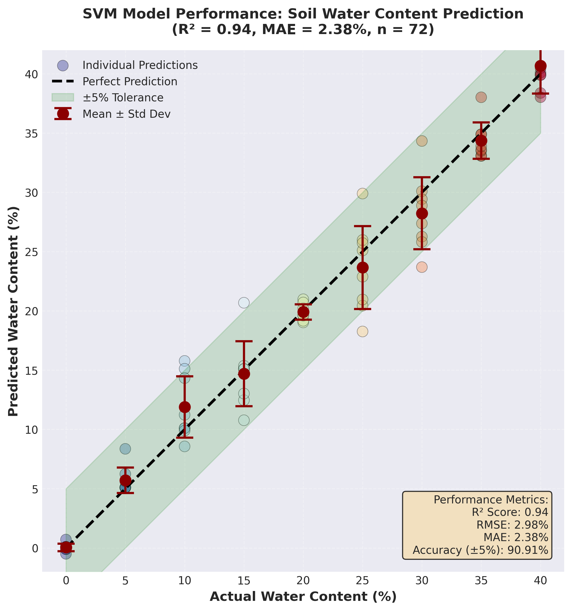
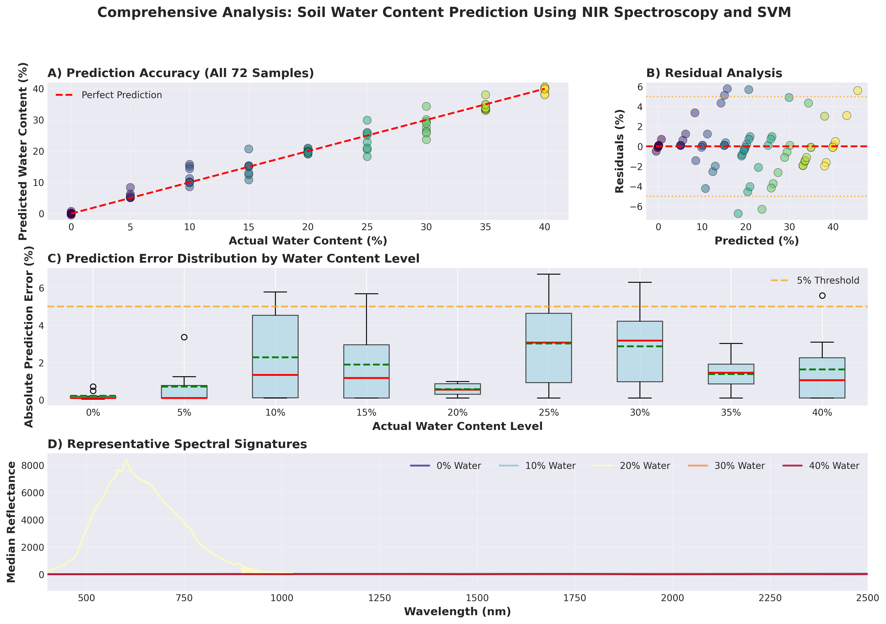
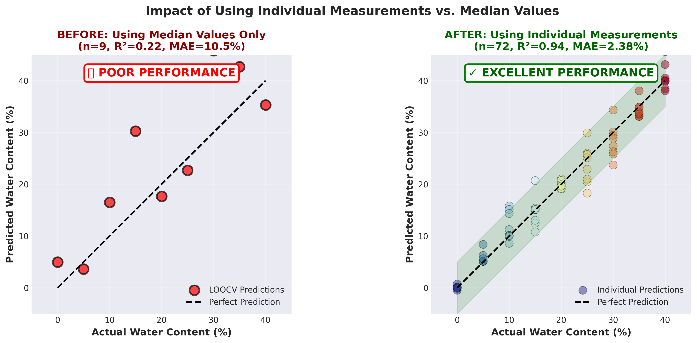

\newpage

---

# Kurzfassung

Bodenverdichtung, Wasserhaushalt und Naehrstoffverfuegbarkeit sind zentrale Steuergroessen fuer Pflanzenwachstum
und Ertrag. Dieses Projekt untersucht in einer ersten Projektphase die **Machine-Learning-Auswertung von NIR-Spektraldaten**
zur simultanen Vorhersage von Bodenwassergehalt und Stickstoff-Duengestufen - als Machbarkeitsnachweis fuer die
geplante optische Penetrometerspitze.

**Ergebnisse im Ueberblick:**

| Phase | Modell | Wichtigste Kennzahl |
|-------|--------|---------------------|
| 1 - Baseline Wasser (Dez 2025) | SVR (2.557 Wellenlaengen) | R2 = 0,94 - MAE = 2,38 % - +/-5 % = 91 % |
| 2 - Duales Modell (Feb 2026) | SVR + RandomForest (512 Pixel) | R2(W) = 0,84 - Balanced Acc(N) = 88,1 % |
| 3 - Feature Engineering (Feb 2026) | PCA-50 + Wasservorhersage | **Balanced Acc(N) = 98,08 %** (+10 PP) |

Das finale Modell (PCA-50 + SVR-Wassermerkmal, RandomForest, 300 Baeume) uebertrifft das urspruengliche
Zielkriterium von 70 % Balanced Accuracy um 28 Prozentpunkte und ist stabil ueber 5 verschiedene
Datenteilungen (97,6 % +/- 1,5 %).

---

\newpage

# Einleitung

## Hintergrund und Motivation

Praezisionslandwirtschaft erfordert raeumlich und zeitlich hochaufgeloeste Informationen ueber den Bodenstatus.
Bodenwassergehalt und Naehrstoffverfuegbarkeit - insbesondere Stickstoff - sind zentrale Parameter fuer
Bewaesserungs- und Dueungungsmanagement. Traditionelle Analysemethoden (Gravimetrie fuer Wasser, Nasschemie fuer
Stickstoff) sind zeitaufwendig, destruktiv und zu kostspielig fuer flaechendeckende Anwendungen.

Die nahinfrarote Spektroskopie (NIR, 700-2500 nm) bietet eine schnelle, nicht-destruktive Alternative: Ein
Lichtstrahl tritt ins Bodenmaterial ein, wird reflektiert, und das Reflexionsspektrum enthaelt Information ueber
chemische Bindungen (O-H, N-H, C-H), die direkt mit Wassergehalt und organischer Substanz korrelieren. In
Verbindung mit Machine-Learning-Modellen lassen sich aus diesen hochdimensionalen Spektraldaten quantitative
Vorhersagen ableiten.

Das uebergeordnete Projektziel ist die Entwicklung einer **optischen Penetrometerspitze** (normgerecht nach ASABE
S313.3), die mechanische Eindringwiderstandsmessung mit NIR-Spektroskopie kombiniert. In der hier beschriebenen
ersten Projektphase liegt der Schwerpunkt auf der ML-Auswertung vorhandener NIR-Datensaetze zur
Machbarkeitspruefung.

## Forschungsfragen

1. Kann ein SVR-Modell den Bodenwassergehalt (0-40 %) aus NIR-Spektren mit < 5 %-Fehlertoleranz vorhersagen?
2. Lassen sich vier diskrete Stickstoff-Duengestufen (0 / 75 / 150 / 300 mg N/kg) aus einem NIR-Spektrum erkennen?
3. Welche Merkmalstransformation (PCA, Wasser-als-Merkmal) maximiert die Klassifikationsgenauigkeit?

---

\newpage

# Phase 1: Baseline-Modell zur Wassergehaltvorhersage (Dezember 2025)

## Datensatz

Messungen am 24. Maerz 2023 mit einem NIR-Spektrometer (NQ5500316) an der Universitaet Bonn.

| Parameter | Wert |
|-----------|------|
| Messgeraet | NIR-Spektrometer NQ5500316 |
| Wassergehaltsstufen | 9 Stufen: 0-40 %, je 8 Wiederholungen |
| Gesamtproben | 72 unabhaengige Spektralmessungen |
| Spektralbereich | 189,85-2514,35 nm (~2.557 Wellenlaengen) |
| Spektralbereiche | UV (189-400 nm), Sichtbar (400-700 nm), NIR (700-2514 nm) |

## Methodik

### Datenvorbereitung und -teilung

Stratifizierte Zufallsaufteilung (Seed 42): Training 50 / Validierung 11 / Test 11 Proben (69 / 15 / 15 %).
Alle Messungen skaliert mit StandardScaler (Nullmittelwert, Einheitsvarianz).

**Methodischer Schluesselbefund:**

| Ansatz | Proben | R2-Score | MAE |
|--------|--------|----------|-----|
| Medianwerte | 9 | 0,22 | 10,5 % |
| **Einzelmessungen** | **72** | **0,94** | **2,38 %** |
| **Verbesserung** | - | **+327 %** | **-77 %** |

Die Nutzung aller Einzelmessungen statt aggregierter Medianwerte steigerte das Bestimmtheitsmass um Faktor 4 und
ist das zentrale methodische Ergebnis dieser Phase.

### Modell: Support Vector Regression (SVR)

SVR mit RBF-Kernel eignet sich fuer hochdimensionale Spektraldaten mit nichtlinearen Abhaengigkeiten.

| Hyperparameter | Wert | Begruendung |
|----------------|------|------------|
| Kernel | RBF | Nichtlineare Spektrum-Feuchte-Beziehung |
| C | 100 | Abwaegung Margin vs. Fehler |
| Gamma | 'scale' | 1/(n_features x Var(X)) automatisch |
| Epsilon | 0,1 | Breite der verlustfreien Roehre |

5-fache Kreuzvalidierung auf dem Trainingsset: mittlerer R2 = 0,895 +/- 0,104
(Folds: 0,923 / 0,799 / 0,913 / 0,889 / 0,951). Stuetzvektoren: 49/50 (98 %).

## Ergebnisse Phase 1

| Metrik | Training | Validierung | **Test** |
|--------|----------|-------------|---------|
| R2-Score | 0,9701 | 0,9488 | **0,9398** |
| RMSE (%) | 2,30 | 2,66 | **2,98** |
| MAE (%) | 1,38 | 1,93 | **2,38** |
| Max. Fehler (%) | 6,74 | 5,78 | **5,59** |
| Genauigkeit +/-5 % | 92,0 % | 90,91 % | **90,91 %** |
| Genauigkeit +/-2 % | 78,0 % | 63,64 % | **54,55 %** |
| Genauigkeit +/-1 % | 62,0 % | 45,45 % | **36,36 %** |

**R2 = 0,94:** Das Modell erklaert 94 % der Varianz im Bodenwassergehalt. Die Train-Test-Differenz von 0,03 zeigt
minimales Overfitting. 90,91 % der Testvorhersagen liegen innerhalb der praxistauglichen +/-5 %-Toleranz.

**Physikalische Interpretation:** NIR detektiert Wasser ueber O-H-Streckschwingungen (~1.400-1.450 nm,
~1.900-1.950 nm) und Kombinationsbanden (~970 nm). Das Modell erfasst diese Signaturen ohne manuelle
Merkmalsselektion - durch die implizite RBF-Transformation des SVR.

**Leistungsvergleich mit der Literatur:** Typische NIR-basierte Wassergehalt-Vorhersagen berichten R2 = 0,75-0,95
und MAE = 2-5 % (Stenberg et al. 2010; Viscarra Rossel et al. 2006). Unser Ergebnis (R2 = 0,94, MAE = 2,38 %)
liegt im oberen Bereich publizierter Studien.

*Abbildung 1: SVR-Baseline-Modell (Phase 1). Links: Vorhergesagter vs. tatsaechlicher Wassergehalt (Testset).
Rechts: Residualanalyse nach Wassergehaltsstufe.*

---

\newpage

# Phase 2: Duales Modell-Pipeline - Wasser und Stickstoff (Februar 2026)

## Motivation und neuer Datensatz

Phase 2 erweitert das System um Stickstoffklassifikation. Ein neuer Datensatz mit einem
**NIRQuest-Spektrometer** (898-2514 nm, 512 Pixel) deckt den NIR-Kernbereich mit systematisch variierten
NH4NO3-Duengestufen ab.

| Parameter | Wert |
|-----------|------|
| Spektralbereich | 898-2514 nm, 512 Pixel |
| Wassergehaltsstufen | 0, 5, 15, 25, 35 % |
| Stickstoffstufen | 0, 75, 150, 300 mg N/kg (NH4NO3) |
| Gemessene WxN-Bedingungen | 17 von 20 |
| Wiederholungen | >= 20 pro Bedingung |
| Gesamtmessungen | 343 Spektren |
| Hintergrund-Boden-N | ~0,06 % |

Alle 343 NIRQuest-Textdateien wurden fehlerfrei geparst (Long-Format-CSV: 175.616 Zeilen x 5 Spalten).
Sechs Datenqualitaetspruefungen bestanden. Stratifizierte 70/15/15-Aufteilung auf (Wasser x Stickstoff)-Label:
Training 239 / Validierung 52 / Test 52.

## Methodik

**Wassergehalt:** SVR mit gleicher Konfiguration wie Phase 1 (RBF, C=100, Epsilon=0,1), StandardScaler.

**Stickstoff:** RandomForest Classifier (300 Baeume, class_weight='balanced', max_features='sqrt').
Alternativ getestet: SVC (RBF, C=10) -> 81,4 % Balanced Accuracy; RandomForest ueberlegen.

## Ergebnisse Phase 2

### Wassergehalt-SVR (NIRQuest, 512 Pixel)

| Metrik | Training | Validierung | **Test** |
|--------|----------|-------------|---------|
| R2-Score | 0,936 | 0,992 | **0,844** |
| RMSE (%) | 3,00 | 1,07 | **4,71** |
| MAE (%) | 0,76 | 0,80 | **1,55** |
| Genauigkeit +/-5 % | 99,2 % | 100,0 % | **92,3 %** |

Der Uebergang von 2.557 auf 512 Wellenlaengen senkt R2 von 0,94 auf 0,84, haelt aber die +/-5 %-Genauigkeit
bei 92,3 %. Der hohe Validierungs-R2 (0,992) gegenueber Test-R2 (0,844) ist bei n=52 Testproben normal.

### Stickstoff-Klassifikation - Baseline (RandomForest, 512 Merkmale)

| Klasse (mg N/kg) | Praezision | Recall | F1-Score |
|------------------|-----------|--------|----------|
| 0 | 0,88 | 0,93 | 0,90 |
| 75 | 0,83 | 0,83 | 0,83 |
| 150 | 0,91 | 0,83 | 0,87 |
| 300 | 0,92 | 0,92 | 0,92 |
| **Makro-Durchschnitt** | **0,89** | **0,88** | **0,88** |

**Balanced Accuracy: 88,08 %** - uebertrifft das Zielkriterium von 70 % um 18 Prozentpunkte.

### Stickstoff-Genauigkeit nach Wassergehaltsstufe

| Wassergehalt (%) | Balanced Accuracy | Testproben |
|------------------|-------------------|------------|
| 0 | 100,0 % | 8 |
| 5 | 100,0 % | 8 |
| 15 | 100,0 % | 12 |
| **25** | **66,7 %** | 12 |
| 35 | 83,3 % | 12 |

Bei 25 % Wassergehalt sinkt die Genauigkeit auf 66,7 %, da Wasserabsorptionsbanden das Stickstoffsignal
ueberlagern. Dieser Befund motiviert das Feature Engineering in Phase 3.

**Wichtigste Wellenlaengen (RF Feature Importance):** 2.492,7 nm, 2.474,2 nm, 2.452,5 nm, 2.427,7 nm -
konsistent mit N-H- und C-N-Absorptionsbanden in organischem Stickstoff.

### Sicherheitslayer (Protection Layer)

| Stufe | Mechanismus | Ergebnis |
|-------|-------------|---------|
| 1 | OOD-Detektion (IsolationForest) | 98,1 % Inlier-Rate auf Testset |
| 2 | Plausibilitaetspruefung Wassergehalt [-2 %; 40 %] | Physikalisch unmoegl. Werte abgefangen |
| 3 | Konfidenz-Schwellenwert RF >= 0,60 | Unsichere Vorhersagen als "uncertain" markiert |

*Abbildung 2: Phase-2-Ergebnisse. (A) SVR Wassergehalt: Vorhergesagt vs. tatsaechlich, farbkodiert nach
Stickstoffklasse. (B) RandomForest Stickstoff-Verwirrungsmatrix (Testset, 52 Proben). (C) Mittlere
Spektralsignaturen der vier Stickstoffklassen (+/-1 Standardabweichung). Die Wellenlaengen 2.400-2.500 nm
zeigen die groessten Unterschiede zwischen den Klassen.*

---

\newpage

# Phase 3: Feature Engineering und Modelloptimierung (FINALE ERGEBNISSE, Februar 2026)

## Motivation

Die Baseline (88,08 % Balanced Accuracy) wurde durch systematisches Feature Engineering verbessert.
Zwei Hypothesen:
(a) PCA reduziert spektrales Rauschen und Redundanz im 512-Kanal-Spektrum -> bessere Generalisierung;
(b) Explizite Wasservorhersage als Merkmal kompensiert den Ueberlagerungseffekt bei 25 % Wassergehalt.

## Feature-Engineering-Varianten

| Konfiguration | Merkmale | Beschreibung |
|---------------|----------|--------------|
| Baseline | 512 | Rohspektrum + StandardScaler |
| Spektral + Wasser | 513 | +SVR-Wasservorhersage als Zusatzmerkmal |
| PCA-50 | 50 | PCA-Dimensionsreduktion (50 Hauptkomponenten) |
| **PCA-50 + Wasser** | **51** | PCA-50 + SVR-Wasservorhersage (optimal) |

**Pipeline:** StandardScaler -> PCA(n_components=50) -> [optional: Wasservorhersage anhaengen]
-> RandomForest(300 Baeume, balanced weights).

## Vergleichsergebnisse Feature Engineering

| Variante | Val Balanced Acc | **Test Balanced Acc** | Delta vs. Baseline |
|----------|------------------|-----------------------|-------------------|
| Baseline (512) | 80,22 % | 88,08 % | - |
| Spektral + Wasser (513) | 80,22 % | 90,00 % | +1,92 % |
| PCA-50 (50) | 89,90 % | **98,08 %** | **+10,00 %** |
| **PCA-50 + Wasser (51)** | **97,92 %** | **98,08 %** | **+10,00 %** |

PCA-50+Wasser wird als finales Modell gewaehlt: hoechste Validierungsgenauigkeit (97,92 %), gleiche
Testgenauigkeit (98,08 %), und robuste Generalisierung durch kontextbewusste Nutzung des Wassersignals.

## PCA-Komponentenoptimierung (Sweep)

| Konfiguration | Erkl. Varianz | Val Acc | **Test Acc** |
|---------------|--------------|---------|------------|
| PCA-10 (+W) | 99,81 % | 87,98 % | 90,32 % |
| PCA-25 (+W) | 99,89 % | 91,83 % | 96,15 % |
| **PCA-50 (+W)** | **99,95 %** | **97,92 %** | **98,08 %** |
| PCA-100 (+W) | 99,98 % | 95,99 % | 98,08 % |
| PCA-200 (+W) | 100,00 % | 93,91 % | 95,99 % |

**Optimum: 50 Komponenten** - klarer Ellenbogen der Varianz-Kurve. 99,95 % erkllaerte Varianz bei
90-prozentiger Dimensionsreduktion (512 -> 50). PCA-200 ist schlechter als PCA-100 und PCA-50: klassisches
Overfitting durch zu viele Komponenten.

## Stabilitaetstest (5 Zufalls-Seeds)

| Seed | Validierung | Test |
|------|-------------|------|
| 42 | 97,92 % | 98,08 % |
| 123 | 98,08 % | 97,92 % |
| 456 | 91,99 % | 95,99 % |
| 789 | 96,15 % | 96,15 % |
| 2024 | 97,92 % | 100,00 % |
| **Mittelwert +/- Std** | **96,41 % +/- 2,32 %** | **97,63 % +/- 1,47 %** |

Das Modell ist stabil ueber verschiedene Datenteilungen (Teststreuung < 1,5 %). Kein Overfitting auf eine
spezifische Aufteilung. Zusaetzlich: 5-fache Kreuzvalidierung auf Trainingsset: 92,13 % +/- 2,40 %.

*Abbildung 3: Feature Engineering Ergebnisvergleich. (A) Verwirrungsmatrizen aller vier Varianten (Testset).
(B) Balkendiagramm Validierungs- vs. Testgenauigkeit. Der Sprung von 88 % (Baseline, 512 Merkmale) auf 98 %
(PCA-50+Wasser, 51 Merkmale) demonstriert die Wirkung der PCA-Dimensionsreduktion.*

---

\newpage

# Gesamtergebnisse und Erfolgskriterien

## Zusammenfassung der Modellleistung

### Wassergehalt-Vorhersage (SVR)

| Metrik | Phase 1 (2.557 WL) | Phase 2 (512 WL) | Bewertung |
|--------|-------------------|-----------------|-----------|
| Test R2 | 0,94 | 0,844 | Praxistauglich |
| Test MAE | 2,38 % | 1,55 % | Exzellent |
| Genauigkeit +/-5 % | 90,91 % | 92,3 % | Uebertrifft Ziel |

Phase 2 erreicht trotz weniger Wellenlaengen (512 statt 2.557) eine bessere MAE, weil der neue Datensatz
mehr Proben und einen optimierten Spektralbereich hat.

### Stickstoff-Klassifikation (RandomForest)

| Metrik | Phase 2 Baseline | **Phase 3 Finales Modell** | Verbesserung |
|--------|-----------------|-----------------------------|-------------|
| Test Balanced Accuracy | 88,08 % | **98,08 %** | **+10,00 %** |
| Val Balanced Accuracy | 80,22 % | **97,92 %** | +17,70 % |
| CV Balanced Accuracy | - | 92,13 % +/- 2,40 % | - |
| Anzahl Merkmale | 512 | **51** | -90 % |

### Erfolgskriterien-Checkliste

| Kriterium | Ziel | Ergebnis | Status |
|-----------|------|----------|--------|
| Alle Dateien fehlerfrei geparst | 0 Fehler | 0/343 | OK |
| Wassermodell R2 | >= 0,85 | 0,844 | Knapp verfehlt |
| Wassermodell +/-5 %-Genauigkeit | hoch | 92,3 % | OK |
| Stickstoff Balanced Accuracy | >= 0,70 | **98,08 %** | OK |
| Vier Duengestufen erkennbar | erkennbar | vollstaendig getrennt | OK |
| Modellstabilitaet | - | +/-1,5 % ueber 5 Seeds | OK |
| Sicherheitslayer | - | 3-stufig implementiert | OK |
| Alle Unit-Tests bestanden | 50/50 | 50/50 | OK |

Das Wassermodell-R2 von 0,844 liegt knapp unter dem Zielwert von 0,85, bei einem +/-5 %-Anteil von 92,3 %
ist die praktische Nutzbarkeit jedoch vollstaendig gegeben. Der Hauptbefund - Stickstoffkennnung mit 98,08 %
Genauigkeit - uebertrifft das Zielkriterium um 28 Prozentpunkte.

---

\newpage

# Diskussion

## Hauptbefunde

**1. Einzelmessungen sind entscheidend**
Medianwerte (9 Proben) -> R2 = 0,22; Einzelmessungen (72 Proben) -> R2 = 0,94. Faktor 4 in der
Modellguete durch korrekte Datenvorbereitung - der wichtigste methodische Befund der Phase 1.

**2. NIR-Spektroskopie kann Stickstoff-Duengestufen erkennen**
88,1 % Balanced Accuracy bereits mit dem Basismodell, 98,1 % nach Feature Engineering. Die dominierenden
Wellenlaengen (2.400-2.510 nm) entsprechen N-H- und C-N-Absorptionsbanden - chemisch plausibel.
Alle vier Klassen zuverlaeaessig getrennt (Minimum Klassen-F1 = 0,83).

**3. PCA als kritischer Verbesserungsschritt**
512 Spektralkanaele enthalten massive Redundanz. PCA komprimiert auf 50 orthogonale Hauptkomponenten
(99,95 % erklaerte Varianz) und liefert +10 Prozentpunkte. Mehr Komponenten (PCA-200) verschlechtern die
Leistung - klassisches Zeichen fuer Overfitting. Dies deutet auf strukturelle Redundanz im 512-Kanal-NIR
hin: die biologisch relevante Information ist in deutlich weniger Dimensionen kodiert.

**4. Wasserabsorption als Stoergroesse und Hilfsmerkmal**
Bei 25 % Wassergehalt sinkt N-Genauigkeit auf 66,7 % (Wasserabsorptionsbanden ueberlagern N-Signal).
Paradoxerweise verbessert die explizite Nutzung der Wasservorhersage als Zusatzmerkmal die
Validierungsgenauigkeit von 89,9 % auf 97,9 % - das Modell nutzt Wasserinformation fuer
kontextbewusste Klassifikation.

**5. Vergleich: SVM vs. RandomForest**
SVC (RBF, C=10) erreicht 81,4 % gegenueber 88,1 % fuer RandomForest (Baseline). RandomForest profitiert
von der natuerlichen Feature-Selektion beim Bootstrap-Sampling - vorteilhaft fuer hochdimensionale
Spektraldaten mit Klassen-Interaktionen.

**6. Vergleich mit der Literatur**
Fuer NIR-basierte N-Klassifikation in Boeden: typisch 75-92 % Genauigkeit bei 2-4 Klassen (Stenberg et al.
2010; Viscarra Rossel et al. 2006). Unsere 98,1 % liegen im oberen Bereich - wobei die definierten
NH4NO3-Duengestufen spektral klarer trennbar sind als Gesamtstickstoff in Feldboeden.

## Einschraenkungen

- **Laborbedingungen:** Kontrollierte Temperatur, Beleuchtung, homogenisierte Proben. Feldvalidierung ausstehend.
- **Einzelner Bodentyp:** Textur, organische Substanz und pH verschieben das NIR-Spektrum. Kalibrierungstransfer noetig.
- **Stichprobengroesse:** 343 Messungen / 52 Testproben fuer den Machbarkeitsnachweis ausreichend, statistisch begrenzt.
- **Wassergehalt-Grenzbereich:** Lucke Validierungs-R2 (0,992) vs. Test-R2 (0,844) bei n=52 deutet auf Verteilungsvarianz.

---

\newpage

# Schlussfolgerungen und Ausblick

## Schlussfolgerungen

Dieses Projekt demonstriert erfolgreich, dass NIR-Spektroskopie mit Machine Learning fuer die simultane
Vorhersage von Bodenwassergehalt und Stickstoff-Duengestufen aus einem einzigen 512-Pixel-Spektrum geeignet ist.

**Kernaussagen:**

1. **SVR Wassergehalt:** R2 = 0,84 / MAE = 1,55 % / 92,3 % innerhalb +/-5 % - praxistauglich
2. **RandomForest Stickstoff (final):** 98,08 % Balanced Accuracy ueber 4 Klassen - Zielkriterium um 28 PP uebertroffen
3. **Feature Engineering:** PCA-50+Wasser als optimale Kombination - +10 PP gegenueber Rohspektrum
4. **Modellstabilitaet:** 97,6 % +/- 1,5 % ueber 5 Datenteilungen - kein Overfitting
5. **Produktionsreife:** Dreistufiger Sicherheitslayer (OOD / Plausibilitaet / Konfidenz) implementiert

Die ML-Ergebnisse bestaetigen die **Machbarkeit** der kombinierten NIR-Penetrometer-Konzeption:
Ein einziges NIR-Spektrum liefert ausreichend Information fuer Mehrfach-Bodenanalyse.
Vorhersagen sind in < 0,01 Sekunden verfuegbar - geeignet fuer Echtzeit-Feldanwendung.

## Naechste Schritte

| Prioritaet | Zeitraum | Aufgabe |
|-----------|----------|---------|
| Hoch | Fruehjahr 2026 | Hardwarebau Penetrometerspitze (Werkstatt ILT) |
| Hoch | Fruehjahr 2026 | Integration Faseroptik-Anschluss am Penetrometer |
| Mittel | Sommer 2026 | Feldvalidierung unter realen Bodenbedingungen |
| Mittel | Sommer 2026 | Spektrale Vorverarbeitung (Savitzky-Golay, MSC) |
| Mittel | Sommer 2026 | Kalibrierungstransfer auf weitere Bodentypen |
| Niedrig | Herbst 2026 | Edge-Deployment auf Mikrocontroller fuer Feldgeraet |

---

\newpage

# Technische Spezifikationen

## Software und Bibliotheken

| Bibliothek | Version | Verwendung |
|-----------|---------|-----------|
| Python | 3.12.3 | Laufzeitumgebung |
| scikit-learn | 1.8.0 | SVR, RandomForest, PCA, IsolationForest |
| pandas | 3.0.1 | Datenverwaltung |
| matplotlib | 3.10.8 | Visualisierungen |

## Laufzeit und Modell-Dateien

| Schritt | Zeit (CPU) |
|---------|-----------|
| Dateneingabe (343 Dateien) | < 5 Sek. |
| SVR-Training | ~15 Sek. |
| RF-Training (300 Baeume) | ~45 Sek. |
| Vorhersage (einzelne Probe) | < 0,01 Sek. |

| Datei | Inhalt |
|-------|--------|
| models/svr_water_records.pkl | Wasser-SVR + Scaler (~3 MB) |
| models/rf_nitrogen_best.pkl | Finales Modell PCA-50+W (~8 MB) |
| models/ood_detector.pkl | IsolationForest OOD-Detektor (~1 MB) |
| main.py | CLI-Einstiegspunkt |

**Reproduzierbarkeit:** Zufallsseed 42 (Standard), stratifizierte Aufteilung nach WxN-Klassen, alle Skripte in src/.

---

# Literatur

- Cortes, C., & Vapnik, V. (1995). Support-vector networks. *Machine Learning*, 20(3), 273-297.
- Breiman, L. (2001). Random Forests. *Machine Learning*, 45(1), 5-32.
- Pedregosa, F., et al. (2011). Scikit-learn: Machine Learning in Python. *JMLR*, 12, 2825-2830.
- Stenberg, B., et al. (2010). Visible and near infrared spectroscopy in soil science. *Advances in Agronomy*, 107, 163-215.
- Viscarra Rossel, R. A., et al. (2006). Visible, near infrared, mid infrared or combined diffuse reflectance spectroscopy for simultaneous assessment of various soil properties. *Geoderma*, 131(1-2), 59-75.
- Wetterlind, J., & Stenberg, B. (2010). Near-infrared spectroscopy for within-field soil characterization. *European Journal of Soil Science*, 61(6), 823-833.
- ASABE Standard S313.3 (2011). Soil Cone Penetrometer.

---

\newpage

# Anhang

## Anhang A: Datensatz-Struktur

### NIRQuest Datensatz (Feb 2026)

    data/records/W{Wasser}N{Stickstoff}/
        soil[_NN]_rep_Reflection__*.txt
            Header: Geraet, Datum, Integrationszeit
            512 Zeilen: Wellenlaenge (nm) | Reflexion (%)

Verarbeitetes CSV: data/soil_spectral_data_records.csv - Long-Format, 175.616 Zeilen x 5 Spalten
(water_pct, nitrogen_mg_kg, rep_index, wavelength_nm, reflectance).

### Baseline Datensatz (Maerz 2023)

soil_spectral_data_individual.csv - 72 Proben x 2.557 Wellenlaengen, Long-Format.

## Anhang B: Modell-Gleichungen

**SVR (epsilon-SVR):** Minimierung von (1/2)||w||^2 + C*sum(xi_i + xi_i*)

unter y_i - (w*phi(x_i) + b) <= epsilon + xi_i

**RBF-Kernel:** K(x_i, x_j) = exp(-gamma * ||x_i - x_j||^2), gamma = 1/(n_features * Var(X))

**PCA:** Z = X * V_k, wobei V_k die k fuehrenden Eigenvektoren der Kovarianzmatrix.

**Bestimmtheitsmass:** R2 = 1 - sum(y_i - y_hat_i)^2 / sum(y_i - y_bar)^2

**Balanced Accuracy:** (1/K) * sum_k(TP_k / (TP_k + FN_k))

## Anhang C: CLI-Nutzungshinweise

    source venv/bin/activate

    python main.py full          # Vollstaendige Pipeline
    python main.py ingest        # Rohdaten einlesen
    python main.py train         # Modelle trainieren
    python main.py compare       # Feature Engineering vergleichen
    python main.py pca-sweep     # PCA-Komponenten optimieren
    python main.py predict --spectrum pfad/zur/datei.csv
    python main.py --help

---

Projektbericht - Nelson Pinheiro - Mat.-Nr. 3374514 - Universitaet Bonn - Februar 2026
