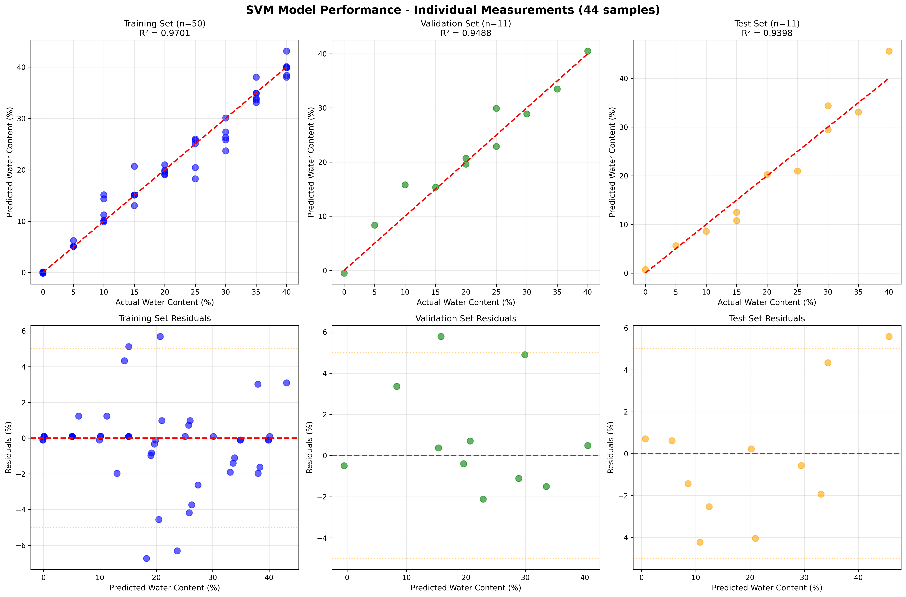
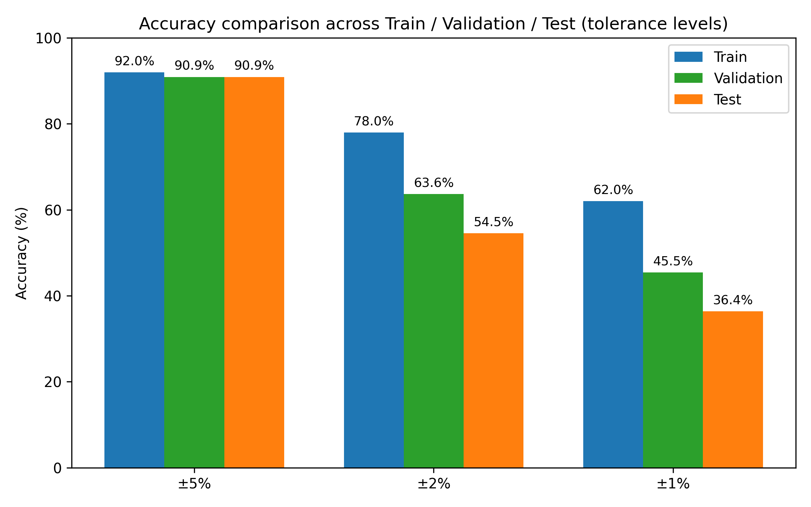

# Soil Water Content Prediction using NIR Spectroscopy and Machine Learning

[](https://www.python.org/downloads/)
[](https://scikit-learn.org/)
[](https://opensource.org/licenses/MIT)

Machine learning model to predict soil water content (0-40%) from near-infrared (NIR) spectral reflectance measurements using Support Vector Regression (SVM).

## 🎯 Project Overview

This project demonstrates the use of NIR spectroscopy combined with machine learning for rapid, non-destructive soil moisture assessment. The trained model achieves:

- **R² Score: 0.94** (excellent correlation)
- **Mean Absolute Error: 2.38%** water content
- **Accuracy: 90.91%** of predictions within ±5%

## 📊 Dataset

- **Source:** NIR Spectrometer (NQ5500316), University of Bonn
- **Measurement Date:** March 24, 2023
- **Samples:** 72 independent spectral measurements
- **Water Content Levels:** 9 levels (0%, 5%, 10%, 15%, 20%, 25%, 30%, 35%, 40%)
- **Spectral Range:** 189.85 - 2514.35 nm (~2,557 wavelengths)
- **Replicates:** 8 measurements per water content level

## 🗂️ Repository Structure

```
.
├── data/
│   ├── Kopie von Feuchtigkeitsstufen.NIR.xlsx  # Original raw data
│   ├── soil_spectral_data_individual.csv       # Cleaned individual measurements
│   ├── soil_spectral_data_summary.csv          # Summary statistics (median, std)
│   └── soil_spectral_data_wide.csv             # Wide format for analysis
│
├── models/
│   └── svm_water_content_model.pkl             # Trained SVM model + scaler
│
├── results/
│   ├── svm_model_individual_measurements.png   # Performance plots
│   └── accuracy_comparison.png                 # Accuracy comparison plot
│
├── src/
│   ├── train_svm_individual.py                 # Main training script
│   └── generate_accuracy_plot.py               # Generate accuracy plots
│
├── PROJECT_REPORT.md                            # Detailed project report
├── README.md                                    # This file
├── requirements.txt                             # Python dependencies
└── .gitignore                                   # Git ignore rules
```

## 🚀 Quick Start

### 1. Clone the Repository

```bash
git clone https://github.com/YOUR_USERNAME/soil-water-content-prediction.git
cd soil-water-content-prediction
```

### 2. Set Up Environment

```bash
# Create virtual environment
python3 -m venv venv

# Activate virtual environment
# On Linux/Mac:
source venv/bin/activate
# On Windows:
# venv\Scripts\activate

# Install dependencies
pip install -r requirements.txt
```

### 3. Train the Model

```bash
python src/train_svm_individual.py
```

This will:
- Load the cleaned spectral data
- Split into train/validation/test sets (70%/15%/15%)
- Train an SVM regression model
- Save the trained model to `models/svm_water_content_model.pkl`
- Generate performance visualizations

### 4. Generate Plots

```bash
python src/generate_accuracy_plot.py
```

## 📈 Results

### Model Performance

| Metric | Training | Validation | Test |
|--------|----------|------------|------|
| R² Score | 0.9701 | 0.9488 | **0.9398** |
| RMSE (%) | 2.30 | 2.66 | **2.98** |
| MAE (%) | 1.38 | 1.93 | **2.38** |
| Accuracy (±5%) | 92.00% | 90.91% | **90.91%** |

### Key Findings

1. ✅ **Excellent predictive performance** with R² > 0.93 on test set
2. ✅ **Good generalization** - minimal overfitting (train-test R² difference = 0.03)
3. ✅ **Practical accuracy** - 91% of predictions within ±5% tolerance
4. ✅ **Robust model** - consistent performance across train/val/test sets

## 🔬 Methodology

### Data Preprocessing
- Extracted individual spectral measurements from Excel sheets
- Created feature matrix: 72 samples × 2,557 wavelengths
- Standardized features (zero mean, unit variance)

### Model
- **Algorithm:** Support Vector Regression (SVR)
- **Kernel:** Radial Basis Function (RBF)
- **Hyperparameters:** C=100, gamma='scale', epsilon=0.1
- **Cross-validation:** 5-fold CV on training set (mean CV R² = 0.89)

### Evaluation
- Stratified train/validation/test split (70%/15%/15%)
- Multiple metrics: R², RMSE, MAE, accuracy at tolerance levels
- Residual analysis for error patterns

## 📊 Visualizations

### 1. Performance Plots


Six-panel visualization showing:
- Actual vs Predicted for train/validation/test sets
- Residual plots for each dataset

### 2. Accuracy Comparison


Bar chart comparing accuracies at ±5%, ±2%, ±1% tolerance levels.

## 🛠️ Usage Example

### Load and Use the Trained Model

```python
import pickle
import numpy as np
from sklearn.preprocessing import StandardScaler

# Load the trained model and scaler
with open('models/svm_water_content_model.pkl', 'rb') as f:
    data = pickle.load(f)
    model = data['model']
    scaler = data['scaler']

# Prepare your spectral data (2557 wavelengths)
# X_new should be shape (n_samples, 2557)
X_new = np.array([...])  # Your spectral measurements

# Scale and predict
X_new_scaled = scaler.transform(X_new)
water_content = model.predict(X_new_scaled)

print(f"Predicted water content: {water_content[0]:.2f}%")
```

## 📝 Project Report

For detailed methodology, analysis, and discussion, see [PROJECT_REPORT.md](PROJECT_REPORT.md).

## 🔄 Next Steps

Potential improvements and extensions:

1. **Dimensionality Reduction**
   - Apply PCA to reduce feature space
   - Identify most important wavelengths

2. **Model Optimization**
   - Grid search for hyperparameter tuning
   - Try ensemble methods (Random Forest, Gradient Boosting)

3. **Feature Engineering**
   - Derivative spectroscopy (1st, 2nd derivatives)
   - Spectral indices for water content

4. **Extended Analysis**
   - If nitrogen content labels become available, build multi-output model
   - Analyze spectral bands sensitive to specific soil properties

## 📚 References

- NIR spectroscopy for soil analysis
- Support Vector Regression for spectral data
- Scikit-learn documentation

## 👥 Contributors

- Nelson Pinheiro
- University of Bonn

## 📄 License

This project is licensed under the MIT License - see the LICENSE file for details.

## 🙏 Acknowledgments

- University of Bonn for providing the spectroscopy equipment
- Data collection: March 24, 2023

---

**Citation:**
If you use this code or data, please cite:
```
Pinheiro, N. (2025). Soil Water Content Prediction using NIR Spectroscopy and Machine Learning. 
University of Bonn. https://github.com/YOUR_USERNAME/soil-water-content-prediction
```
